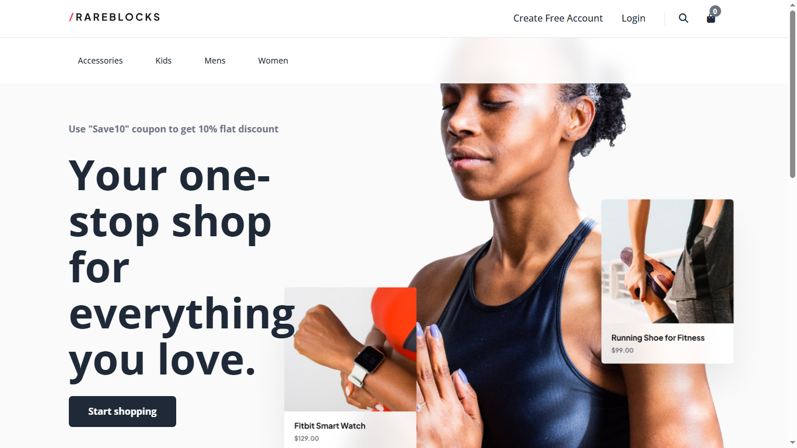
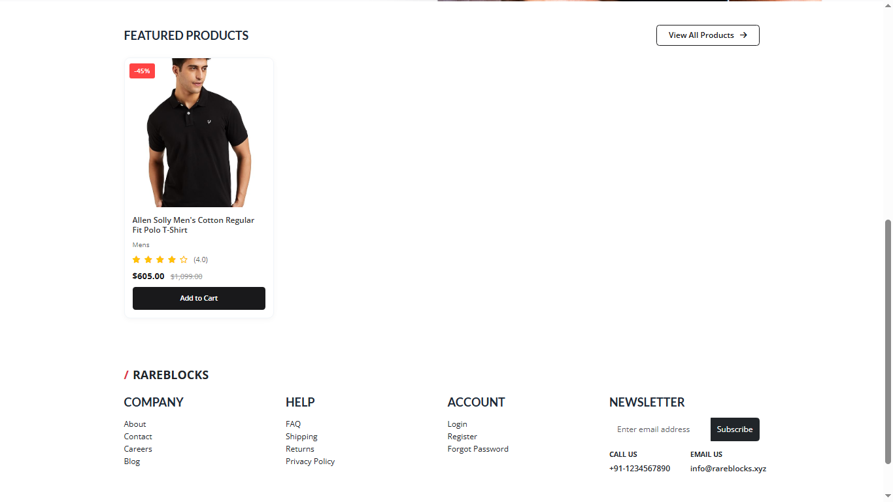
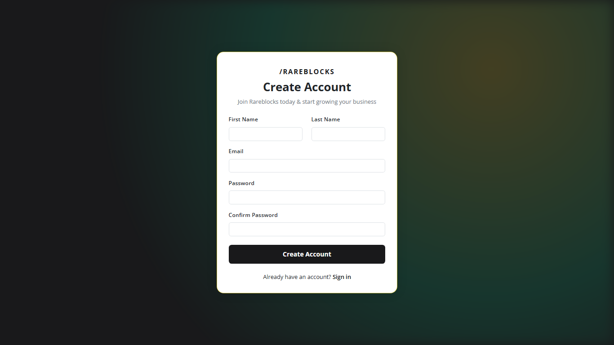
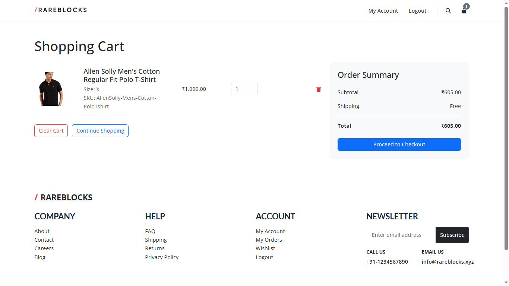
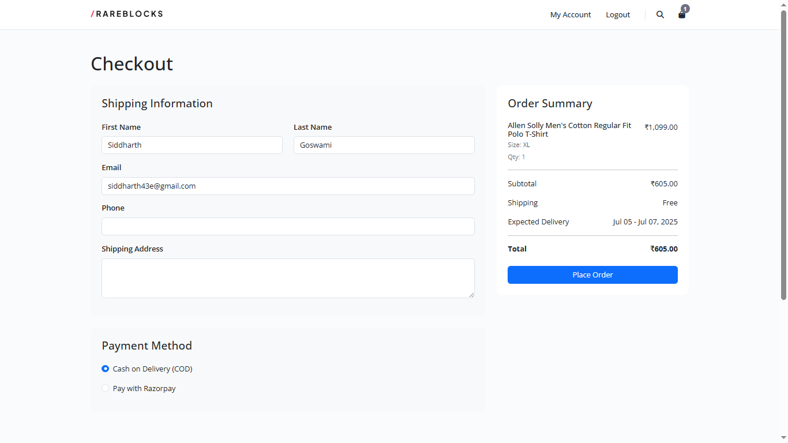
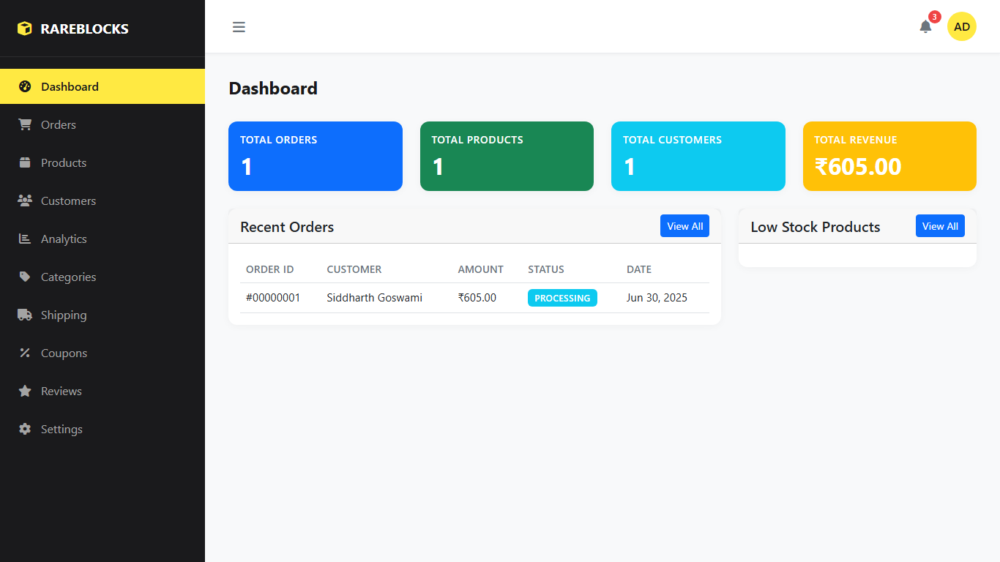

# E-Commerce Web Application

A full-featured e-commerce website built using **PHP**, **MySQL**, and **Razorpay**. This project supports both user and admin functionalities, product and category management, a shopping cart system, and order checkout with payment integration.

---

## 🚀 Features

### User Panel

- Browse products by category
- Add/remove products to cart
- Checkout and pay via Razorpay
- View order details

### Admin Panel

- Add/edit/delete products and categories
- View customer details
- View and manage orders
- Dashboard with analytics

---

## 🛠 Tech Stack

- **Frontend:** HTML, CSS, Bootstrap
- **Backend:** PHP (Core)
- **Database:** MySQL
- **Payment Gateway:** Razorpay
- **Dependency Manager:** Composer

---

## 🗂 Project Structure

```
Ecommerce/
├── add-product.php
├── add-to-cart.php
├── admin-dashboard.php
├── cart.php
├── checkout.php
├── composer.json
├── create-razorpay-order.php
├── database.sql
├── ... more files
```

---

## 📦 Setup Instructions

1. **Clone or Download** the project

```bash
git clone https://github.com/siddharth-0903/ecommerce-app.git
```

2. **Move to Project Directory**

```bash
cd ecommerce-app/Ecommerce
```

3. **Import Database**

- Open `phpMyAdmin`
- Create a database (e.g., `ecommerce_db`)
- Import `database.sql`

4. **Update Database Config**

- Edit the database credentials in your PHP files (if required)

5. **Install Composer Dependencies** (if needed)

```bash
composer install
```

6. **Run the App**

- Place the project in your local server directory (e.g., `htdocs` for XAMPP)
- Access via `http://localhost/Ecommerce`

---

## 💳 Razorpay Integration

Make sure to:

- Create a Razorpay account
- Get your API keys
- Replace dummy API keys in `create-razorpay-order.php` with real ones

---

## 📸 Screenshots

Here are some screenshots from the project:

### 🏠 Homepage


### 🛒 Featured Product Section


### 👤 Registration Page


### 🛍️ Shopping Cart


### 💳 Checkout Page


### 📊 Admin Dashboard


---

## 📄 License

This project is for educational purposes.

---

## 🙌 Acknowledgments

- [Bootstrap](https://getbootstrap.com/)
- [Razorpay Docs](https://razorpay.com/docs/)

---

## ✍️ Author

- **Siddharth Goswami** — [GitHub Profile](https://github.com/siddharth-0903)

---

Feel free to fork this project or open pull requests!

